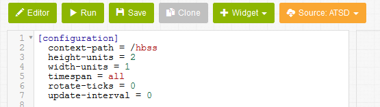

Data Visualization with Chart Lab
==================================

###Introduction###
------------------

Are you looking for clear and concise graphical presentations for your datasets? 

Are wanting to explore different graphical outputs **all in one place**?

Chart Lab is just the thing you have been looking for!

Chart Lab is a versatile online tool which allows users to try out Axibase Time Series Database (ATSD) visualization capabilites. Chart Lab doesn't require any
registration and allows you to experiment with different layouts and widget settings prior to deploying it in your own ATSD instance. For users familiar with
[jsfiddle.net](http://jsfiddle.net/da1rosy8/), Chart Lab shares many of the same properties and characteristics.

The purpose of this article is to walk through and showcase all of the different features of Chart Lab.

###Chart Lab Features###
------------------------

A blank, customizeable Chart Lab portal for your use can be found here: 

Within Chart Lab each of the following items are included:

* Source – switch between data sources: Random and ATSD
* Widget – append a sample widget to the current desired configuration
* Run – apply and view a portal based on current desired configuration
* Save – save current configuration under a new revision in the current directory
* Clone – save current configuration in a new directory
* Editor – toggle configuration editor

Below is an image of the standard default Chart Lab configuraton.

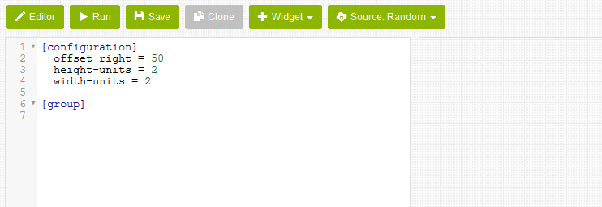 

We will run through each of the features of Chart Lab, starting with **Source**.

###Source###
------------

Chart Lab supports two data sources:

1. Random Data Generator
2. ATSD with real, continuously updated data

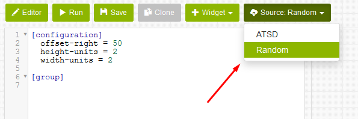

The Random data generator is a non-existent data set which invokes the math.random() javascript. As defined by the [Mozilla Developer Network](https://developer.mozilla.org/en-US/docs/Web/JavaScript/Reference/Global_Objects/Math/random), 
this function returns a floating-point, pseudo-random number in the range [0,1], which is inclusive from 0 up to but not including 1. This range can 
be scaled to fit any desired dataset. These numbers have no meaning or value; every 60 seconds new random numbers are generated with the goal of merely
providing different ranges for visualization purposes. 
  
The ATSD data is real life data. Using Chart Lab, the user is able to draw upon Axibase datasets. Once the user installs ATSD, they will be able to pull in 
their own data, which will be updated in real time as data is added to their datasets.

###Widget###
------------

Chart Lab contains each of the following **Widgets**, as shown in the image below. 

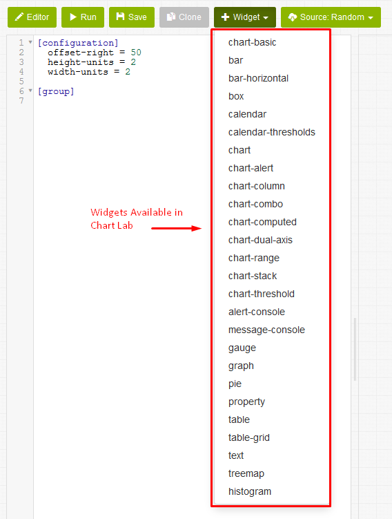

These visualizations can be found at the following link:
     
[https://axibase.com/products/axibase-time-series-database/visualization/widgets/](https://axibase.com/products/axibase-time-series-database/visualization/widgets/)

We will now run through several settings for Widgets in Chart Lab.

Widgets are always added to the bottom of the configuration. In the figure below, a chart Widget was initially added, followed by a histogram Widget. 

As the default settings, Widgets are arranged in a single horizontal line. In order to split the Widgets up into several different lines, you must add
a new **group** to the configuration. In the image below, we cannot see the third Widget (Pie chart) that was added.

If we add a second group (as shown in the below image) and hit Run, we will have a configuration as shown below.

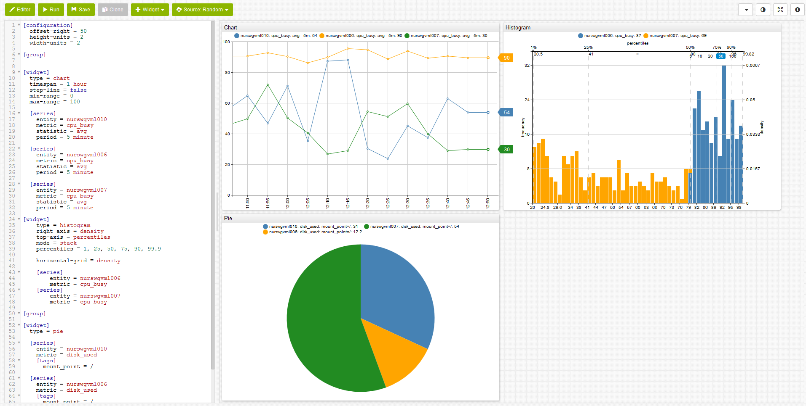

In order to fit more Widgets in a single view, you may change the **height-units** and **width-units** in the configuration. For example, if we change both
of these values from 2 to 4, we will have the configuration as shown below.

Single line comment starts with **#**. Text after **#** will be ignored.

Multi-line comments start with /* and end with */. Any text between /* and */ will be ignored. 

The below figures showcase the comment features. 

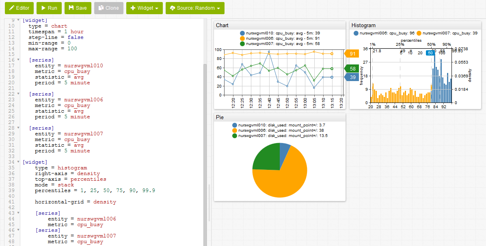

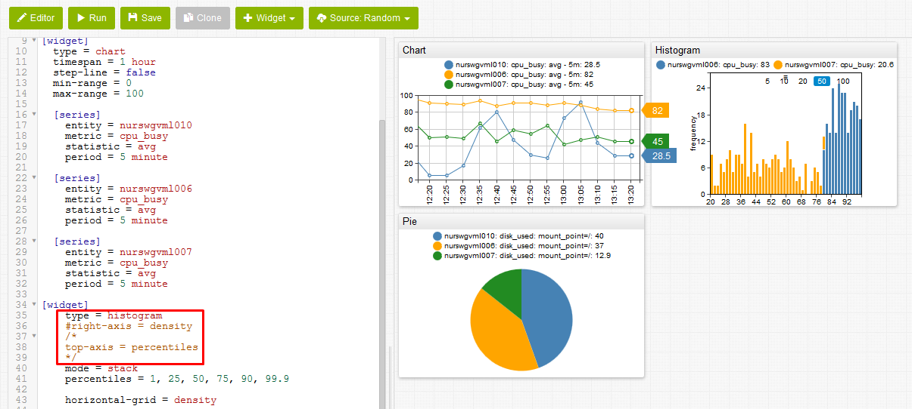

###Run###
---------

Once a **Source** and **Widget** have been selected, the user may then select **Run** to output a visualization. This will display a portal based on 
Widget current configuration. 

###Save###
----------

After a visualization has been output, the user has the option of selecting **Save** to save the current configuration as a new revision in the current 
directory. After pressing **Save**, the current configuration will be assigned a unique URL and a revision number. We will run through a quick example to
demonstrate this process.

1.	Open a blank Chart Lab portal.
2.	Select **Random** as the Source.
3.	Select **Run** to output a visualization.
4.	At this point, we have the option to save our current configuration. Select **Save**.

	After saving, our configuration has been assigned a unique URL and revision number, in this case: 
	
	**[https://apps.axibase.com/chartlab/a9977177](https://apps.axibase.com/chartlab/a9977177)** and **1**.

	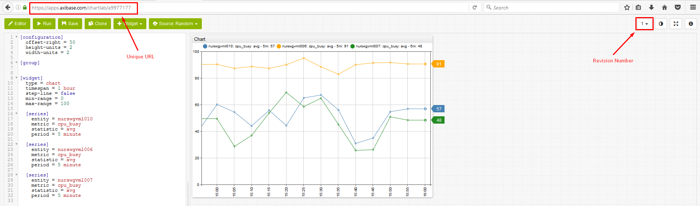
	
	It is worth noting that for a Random Source, because of the math.random() javascipt, unique values will not end up being saved. The configuration
	has been saved, but regardless random values will continue to be output after every 60 seconds.
	
	Let us continue with saving a second revision.

5.	Change Source to **ATSD**.
6.	Select **Save**.

	After saving for a second time, this second configuration has been assigned a totally unique URL and revision number, in this case:
	
	**[https://apps.axibase.com/chartlab/a9977177/2/](https://apps.axibase.com/chartlab/a9977177/2/)** and **2**.

	
	
	Since **ATSD**, which contains real data, was selected as the Source, both the configuration and the data values will be saved.

	Let us continue with saving a third revision.

7.	Change the **max-range** from 100 to 80.

	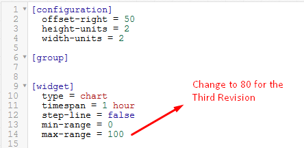

8.	Select **Save**.

	After saving for a third time, this third configuration has been assigned a totally unique URL and revision number, in this case:
	
	**[https://apps.axibase.com/chartlab/a9977177/3/](https://apps.axibase.com/chartlab/a9977177/3/)** and **3**.

	

	Since **ATSD**, which contains real data, was selected as the Source, both the configuration and the data values will be saved. The only change was altering the maximum range from 100 to 80.

	Now the user has the options of toggling between each of the three saved revisions. These three unique URLs will be stored permanetly within Axibase's system.
	The user has the option of coming back to these examples at any time.
	
	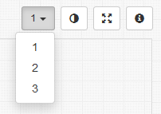

###Clone###
-----------

By selecting **Clone**, the user is allowed to save the current configuration in a new directory. For example, if we clone the third revision from the previous section,
an entirely new unique URL will be created, seperate from the previous nested example.

In this unique case, the URL that was generated is listed below:

[https://apps.axibase.com/chartlab/3fa686a5](https://apps.axibase.com/chartlab/3fa686a5)

All the features of the cloned output are the same as the original, with the noteworthy point being that an entirely new directory was created as a result.

###Editor###
------------

By selecting **Editor**, the user is allowed to display their output in fullscreen. A unique URL will be applied to the full sized output. To revert back 
to the standard view, click the **Editor** button once more. 

###Miscellaneous Remaining Features###
--------------------------------------

In the upper right hand corner of the portal are three additional features that may be used to edit your visualization.

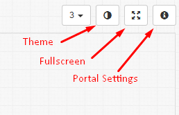

By clicking **Theme**, a black background will appear behind your visualization. Click **Theme** once more to remove the background.

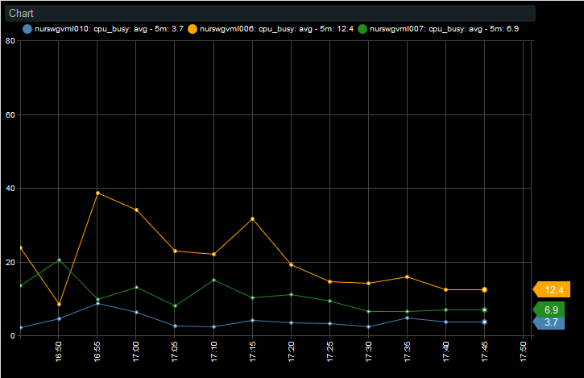

By clicking **Full Screen**, the user is allowed to display their output in fullscreen. Unlike using the **Editor**, a unique URL will not be created
after selecting this option. In addition, Full Screen hides all of the Chart Lab features. To return to the standard Chart Lab view, select **Esc**.

Clicking the information icon takes you **[Portal Settings](https://axibase.com/products/axibase-time-series-database/visualization/widgets/portal-settings/)**. 
This tab contains configuration settings and examples.

###Action Items###
------------------

If this guid has been interesting to, create an example and send it over to us. If you have any comments, questions, or concerns please do not hesitate
to [contact us](https://axibase.com/feedback/)!

