Analyzing UK Aviation Statistics using CAA Datasets
===================================================

### Introduction
----------------

Are airports getting more and more crowded every year?

What some are the busiest airports in the United Kingdom (UK)?

How often do airplanes get delayed?

To answer such questions, the Civil Aviation Authority (CAA) serves as an independent data specialist for the UK government. Established in 1972, the CAA collects and reports on key aviation metrics which summarize the level of activity at UK airports. According to their website, [caa.co.uk](https://www.caa.co.uk/Data-and-analysis/UK-aviation-market/Airports/Datasets/UK-Airport-data/Airport-data-2016-06/), the CAA collects statistics from more than 60 UK airports. Specific metrics are measured for items such as:

* International passenger traffic to and from UK airports
* Terminal passenger totals at different UK airports
* International and domestic mail shipped to and from UK airports (tons)
* And many more! 

CAA datasets are available in two separate formats: raw datasets and aviation trends.

### CAA Raw Datasets
--------------------

CAA raw datasets are published every month, and are available ranging back to 1973. These reports are available in CSV and PDF format, with some reports only being available in one form or another. These datasets merely contain raw data; that is they do not contain any information on analytics or trends, and do not contain any graphs or figures. A link to these raw datasets may be found at the below link:

[https://www.caa.co.uk/Data-and-analysis/UK-aviation-market/Airports/Datasets/UK-airport-data/](https://www.caa.co.uk/Data-and-analysis/UK-aviation-market/Airports/Datasets/UK-airport-data/)

Below is an image of a typical raw data set, taken from [January 2016](https://www.caa.co.uk/uploadedFiles/CAA/Content/Standard_Content/Data_and_analysis/Datasets/Airport_stats/Airport_data_2016_01/Table_11_International_Air_Pax_Traffic_to_from_UK_by_Country.pdf)

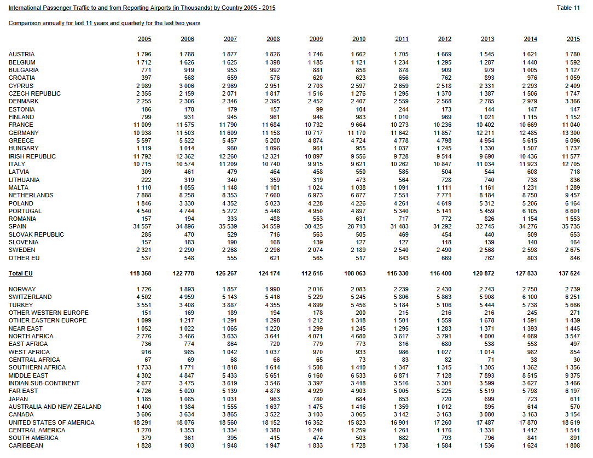

### CAA Aviation Trends
-----------------------

CAA aviation trends are published per quarter (four times per year). These reports date back to 2008 and are published only in PDF format. Language is used in these reports to attempt to put the datasets into context. Graphs and tables showing volumes and year over year (y-o-y) growth rates of datasets are published. These aviation trend files may be found at the below link:

[https://www.caa.co.uk/Data-and-analysis/UK-aviation-market/Airports/Aviation-Trends/](https://www.caa.co.uk/Data-and-analysis/UK-aviation-market/Airports/Aviation-Trends/)

Below is an image of terminal passengers at UK airports from [AviationTrends_2008_Q4](https://www.caa.co.uk/uploadedFiles/CAA/Content/Standard_Content/Data_and_analysis/Analysis_reports/Aviation_trends/AviationTrends_2008_Q4.pdf). In the associated text, terminal passengers are described as "those travelers who board or disembark an aircraft on a commercial flight at a reporting UK airport." The data is shown for scheduled and chartered flights for London and Regional airports. Quantities of travelers and growth percentages are presented comparing, in this case, Q4 of 2008 to 2007, and the entire "rolling" years of Q1 through Q4 of 2007 and 2008, respectively.    

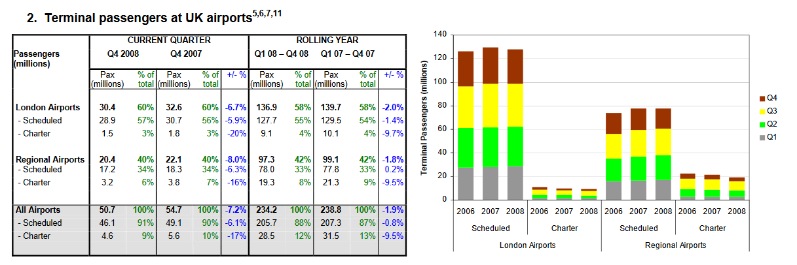

Below is an image from the same report showing terminal passengers at UK airports by origin / destination.

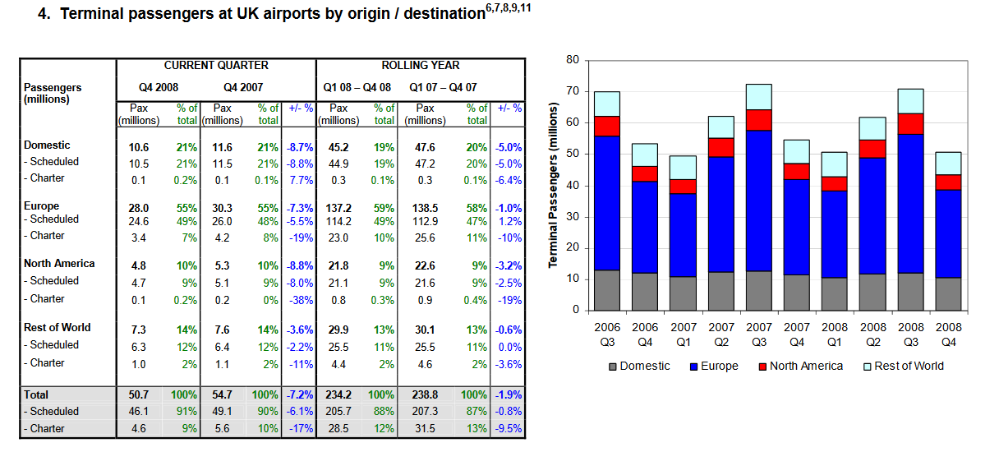

The data is presented for scheduled and chartered flights for passengers from within the UK, Europe, North America, and the Rest of the World. Again, quantities of travelers and growth percentages are presented comparing Q4 of 2008 to 2007, and the entire "rolling" years of Q1 through Q4 of 2007 and 2008, respectively. To summarize the graph, the following sentence is used: "Passenger numbers to all destination groups fell in quarter 4 2008, by around 8%, except for passengers numbers to the Rest of the World destination group, which fell by considerably less."

While the aviation trend PDF files can be helpful, they are not interactive and do not allow the user to easily move through different metrics and datasets. To gain a meaningful understanding of the data and trends over time, you would need to open multiple files at a time and compare trends, which can be difficult and time consuming to work though.

### Axibase Time Series Database (ATSD)
-----------------------------------------

The processing of CAA datasets using Axibase Time Series Database (ATSD) is much less cumbersome. Processing the same data with ATSD is less time consuming because the user has the ability to easily toggle between different datasets and years, and filter out for a specific airport location or metric. ATSD stores the data in the user's own database so that this public data can be combined with internal data sources as well as mixed and matched across different datasets. For example, you could combine the CAA datasets with weather patterns to see if there is any correlation between poor weather and flight delays; or with another country's aviation statistics to see how they compare to UK trends. 

Once you install ATSD, you **don't** have to:

* Add additional datasets from caa.co.uk
* Manipulate and design table schema
* Provision an application server
* Write programs to parse and digest these types of files.

Rather, you can configure a scheduled job to retrieve the file from the specified endpoint and have ATSD parse it according to pre-defined rules. Once you have raw data in ATSD, creating and sharing reports with built-in widgets is fairly trivial. The reports will be continuously updated as new data comes in. Below is a image of the data flow of ATSD.

Using the ATSD default portal for CAA metrics, the user has the ability to filter the CAA datasets to their liking. The following three filters are applied to the default portal:

* First filter: allows the user to sort by CAA metric. **228** different CAA airport aviation metrics can be filtered for. These metrics may be found in the [Appendix](https://github.com/axibase/atsd-use-cases/tree/master/UKAviation#appedix-caa-metric-list). The figure below shows the first metric in the first dropdown: terminal passengers totals for January 2015 to February 2016. 
* Second filter: allows the user to filter between 55 different UK airports. In this case, all airports have been selected. 
* Third filter: allows the user to filter by airport groups (London area, other UK, or no UK reporting airports). In this case, all groups have been selected.  

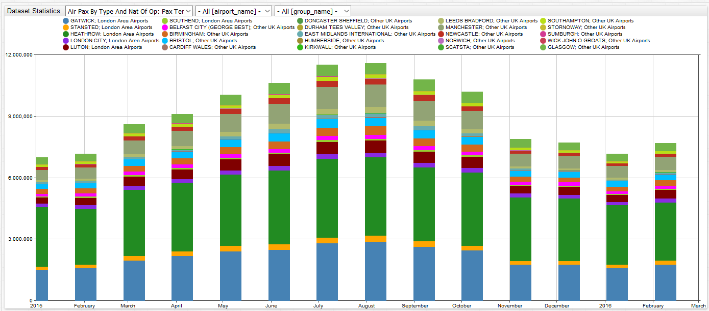

This figure shows total freight (in tons) for 2015 for all 55 airports from January 2015 to February 2016.

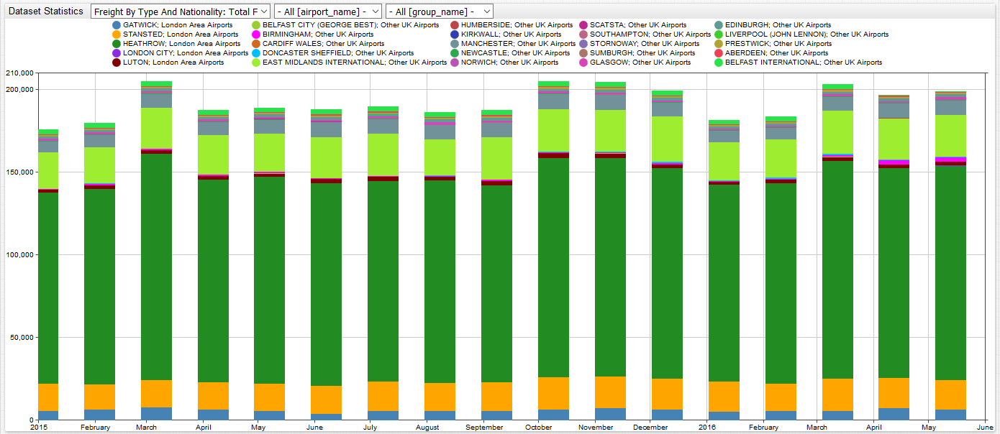

Here, you can explore our complete dataset for CAA aviation statistics by clicking below on the default portal:

### Creating Custom Portals
---------------------------

Custom portals can be created from the default portal. The user has the capability to change or display certain aspects of the dataset to their liking. For example, the user may change graph styling, such as color, graph type, and other display options.

Likewise, by customizing the data the way you want, you can filter out any unnecessary information. If, for example, you are interested in comparing UK Domestic terminal traffic for scheduled flights for different years, you can customize your portal from the default portal to only show that information.

The default portal, from which you can customize the dataset results, again can be found here: **[DEFAULT](https://apps.axibase.com/chartlab/972babb9)**

We will walk through a brief example on how to customize the default portal to compare UK Domestic terminal traffic for scheduled flights between 2015 and 2016. 

### Example 1
-------------

1.  Open the default portal and delete the configuration sections as shown in the image below. We are only wanting to show one series, so there is no need for **multiple-series**, **series-limit**, **tags-dropdown**, **label-format**, **tags-dropdown-style**, or the **dropdown** control.

    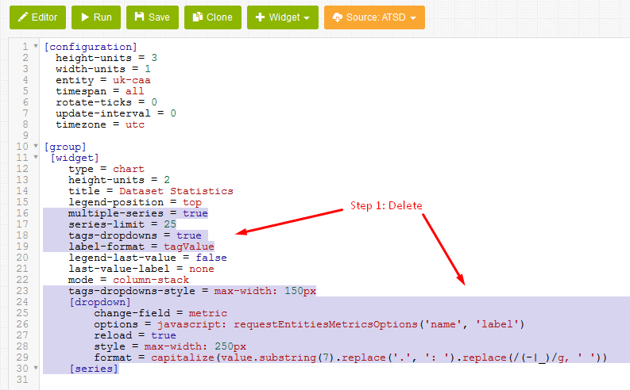

2.  Next, we want to select the one **metric** which we would like to filter for. The first dropdown in Chart Lab only contains the shortened version of the **metric** names. Here is a text file which contains the full raw metric names: [uk-caa-metrics.txt](uk-caa-metrics.txtMagnifier). A complete list of metrics is also available in the [Appendix](https://github.com/axibase/atsd-use-cases/tree/master/UKAviation#appedix-caa-metric-list).

    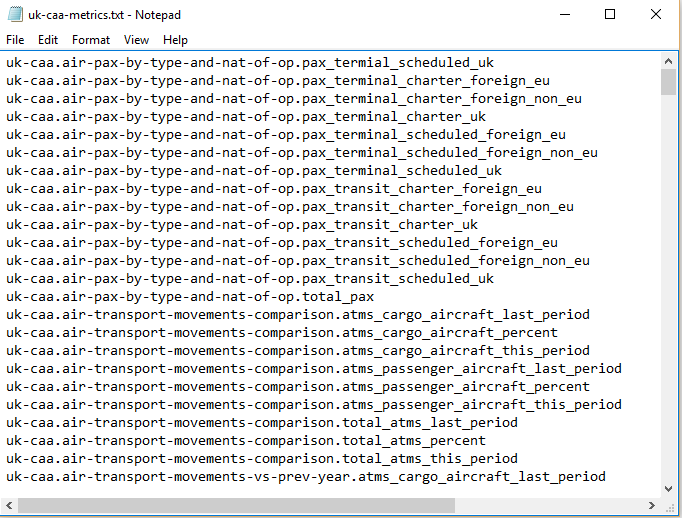

    If you have installed ATSD, you will want to navigate to the metric list to see the corresponding names. You will need to log into your [ATSD account](https://atsd_server:8443/) to view the full raw metric names, which must be used in the configuration. The image below contains the standard view after you have logged in. Press **Entities**.

    
    
3.  Enter **uk-caa** into **Name Mask**. Press Apply.

    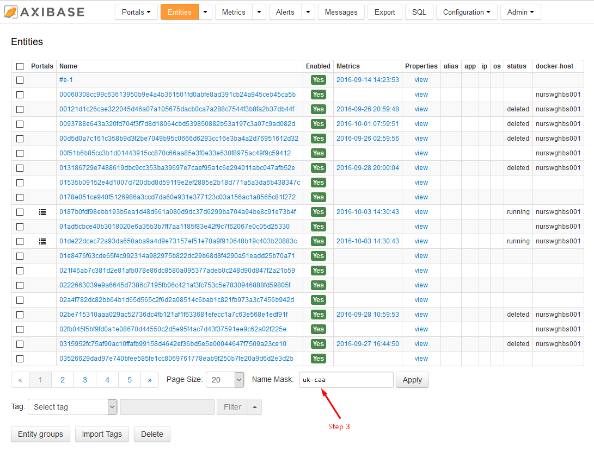
    
4.  Select **2016-06-01 00:00:00**.  

    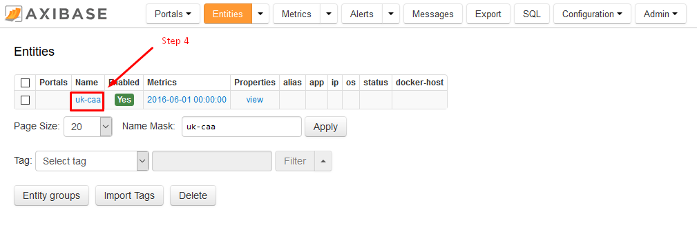

5.  Here, you will see a list of metrics, which are available for the CAA entity. In our case, we are looking for UK Domestic terminal traffic for scheduled flights. Copy the seventh entry from the top of the page, **uk-caa.air-pax-by-type-and-nat-of-op.pax_terminal_scheduled_uk**.

    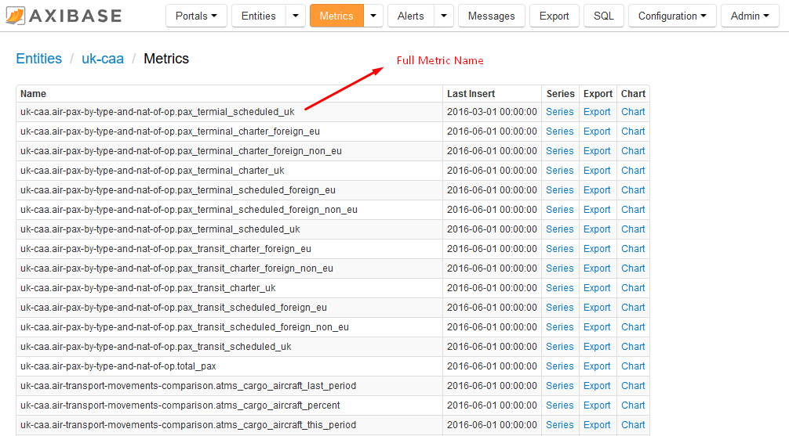
    
6.  Navigate back to the portal. Type in **metric=** and paste the copied metric name from the metric list.
7.  Since we are comparing 2015 and 2016 values, enter **starttime = current_year** and **endtime = next_year**.
8.  As we will be looking at total domestic travel, enter **group-statistic = sum** and change mode from **column-stack** to **column**. The **group-statistic = sum** command calculates the total number of passengers for all airports in a given month, and the **column** will only show the total number of passengers together as one column per month.  

    Your configuration should now look something like the image below.
    
    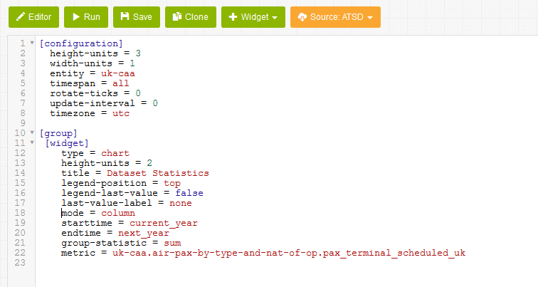

9. Next, again since we are looking at total domestic value, we need to select all airport and group names.  Create a new heading for **[tags]** below **[widget]** and enter **airport_name** = * and **group_name** = * (* is shorthand for all).
10. To display data for 2016, create a new **[series]** and enter **label = current year**.
11. To display data for 2015, create a new **[series]** and enter **label = previous year**. Enter **time-offset = 1 year** and **color = orange**. The **time-offset = 1 year** command shifts historical data by the specific lag to the current time. In our case, data for the year 2015 is displayed as if it were data for 2016.

    Your configuration should now look like the image below.
    
    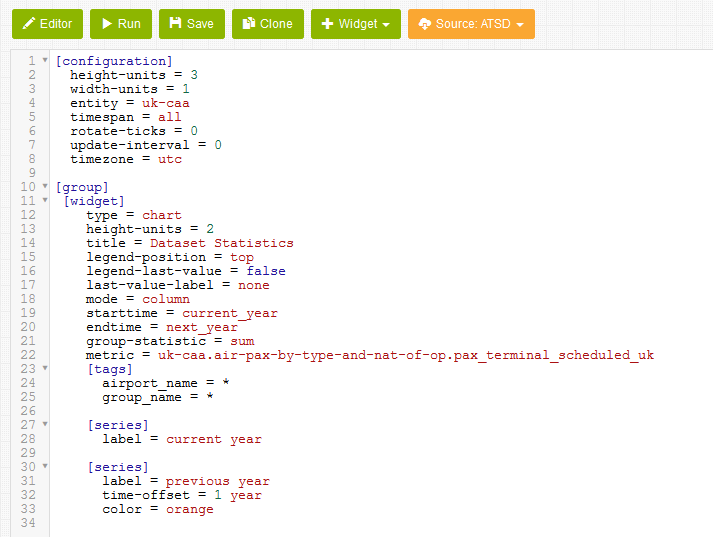
    
12. Press **Run**! Your figure should now look like the image below. 

    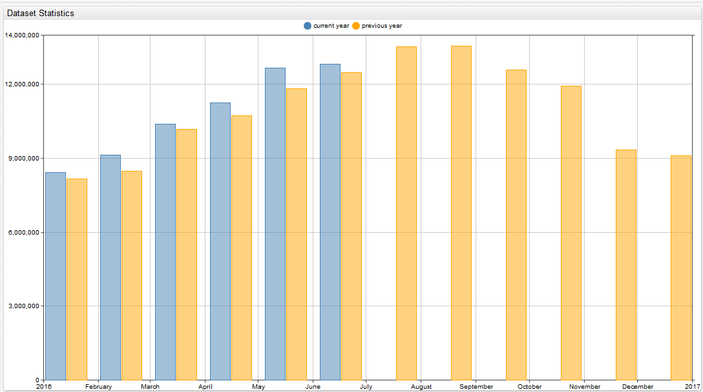
    
    Now, we can take a few more steps to clean up our figure.
    
13. Change the title to **UK Domestic Terminal Traffic on Scheduled Flights**.
14. Under **metric** enter **format = numeric** to shorten the length of the outputted numbers.
15. Press **Run**!

    Your configuration should now look like the image below.
    
    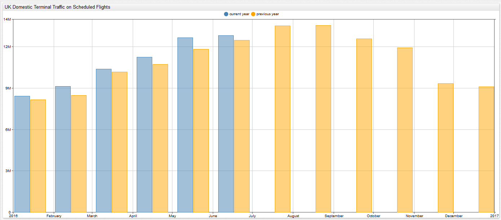

Here you can explore this configuration in Chart Lab: 

### Example 2
-------------

Now that we are familiar with the CAA entity and different available metrics, we can, as an alternative to building a configuration from the default portal, create a configuration from the generic widget settings in Chart Lab. Let us now walk through building a calendar Widget to show the total international passengers traveling from UK airports within the last year.

The default Chart Lab portal can be found here:

1.  Press the Chart Lab link above.
2.  Change the source to **ATSD** and select **calendar** from the Widget drop-down.
3.  Delete the section of the configuration as shown in the image below.

    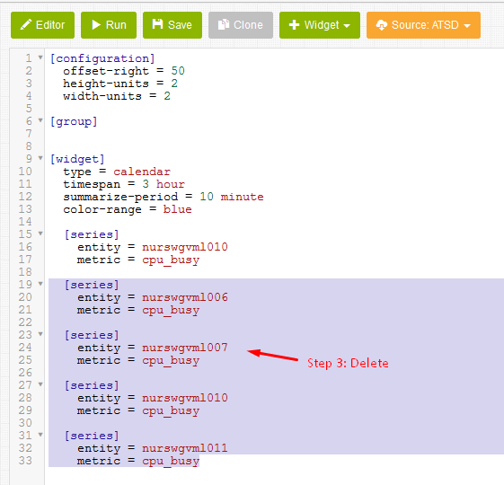
  
4.  Change the entity name to **uk-caa** and the metric name to **uk-caa.eu-and-other-intl-passenger-traffic.total_pax_eu_last_period**, which was taken from the metric list in ATSD.
5.  Since we want to display international passenger figures for all available UK airports, create a **[tags]** heading. Under this heading, enter in **airport_name** = * (* is shorthand for all). 
6.  In the **[configuration]** heading, enter **timezone = UTC**. 
7.  Under the **[widget]** heading, delete the line **timespan = 3 hour**. 
8.  To specific our new timespan, enter in **starttime = 2015-01-01T00:00:00z** and on the next line **endtime = current_month**.
9.  Modify the **summarize-period** line from 10 minutes to 1 month.
10. To display airport names in our figure, enter **label-format = tags.airport_name**. 

    Your configuration should now look like the image below.
  
    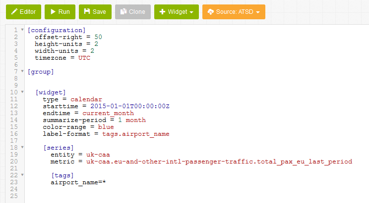
  
11. Press Run!

    Your figure should look like the image below.
    
    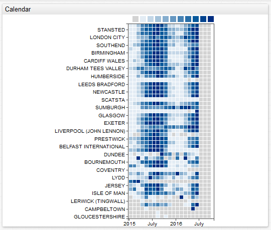
    
    The are a few more steps we can take to clean up our figure.
    
12. To create a figure title, enter **title = UK International Terminal Passenger Traffic: Total Passenger**.
13. To increase the size of our figure, under **[configuration]** change offset-right from 50 to 0 and height-units from 2 to 1.
14. Press Run!
    
    Your figure should look like the image below. 
    
    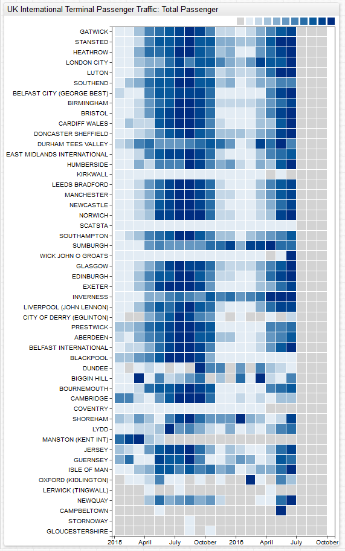
    
    From our figure we can see a month by month breakdown of international passenger traffic from all UK airports. The calendar widget is useful for quickly gaining an understanding of the general trends of a particular dataset, as we as observing any outliers in the set. Generally speaking in our instance, we can see that in 2015 the most popular travel season was from May to October, as indicated by the clumping of lots of dark blue square shading. Additionally, we can see that very travel was taken from November to April. 
    
    We can quickly observe outliers in Shoreham and Oxford (Kidlington) for the months of January and February, respectively, as shown in the figure below.
    
    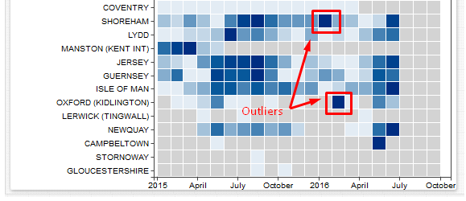
    
    Additionally, we can see observe outliers for Scatsta and Wick John O Groats for the high travel months of May to October, as can be seen in the figure below.
    
    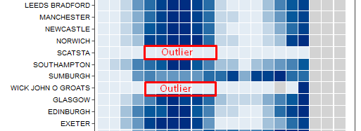
    
    You can explore this portal by clicking on the link below.
    
    
    
    We can quickly change this widget to output a different figure type. For instance, we can change our widget from calendar to pie to see total international passenger figures for June 2016.
  
15. Under the **[widget]** heading, change type from calendar to pie.
16. Delete the lines **summarize-period = 1 month** and **color-range = blue**.
17. Change from **starttime = 2015-01-01T00:00:00Z** to **starttime = current year**.
18. Let us only display the top 15 airports. Enter **display = value > top(15)**.
19. To show a legend with the figure, enter **legend-position = top**.
20. To display numeric values with the figure, enter **series-labels = connected**.
21. Enter **mode = ring**. 
22. Change the title to **UK International Terminal Passenger Traffic: Top 15 Airports June 2016**.
23. Press Run!

    Your new figure should look like the image below.
    
    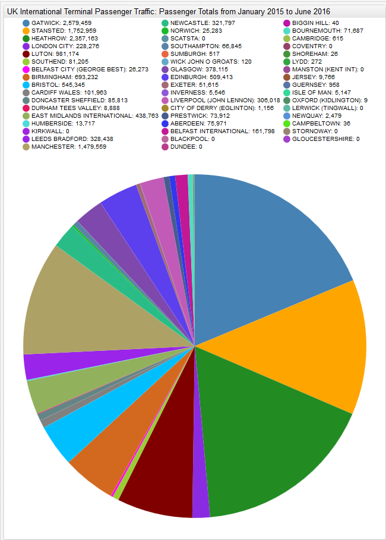
    
    You can explore this portal by clicking on the link below.
    
    

### Example 3
-------------

This is an advanced example using a graph Widget to show traffic distribution between different UK airports for a given time period. This figure shows a single base airport and all of the associated destination airports, which are connected by dashed lines. In the figure below, Heathrow is our base airport and we can see all the different flight paths to airports across the UK for June 2016. Additionally, the heavier the flight path lines, the heavier the traffic between the two associated airports. For example, Heathrow to Edinburgh is dark blue, which indicates heavy traffic, whereas the lines Heathrow to Leeds Bradford and to Newcastle are light gray, which indicates very little traffic.

You can explore this portal by clicking on the link below.     

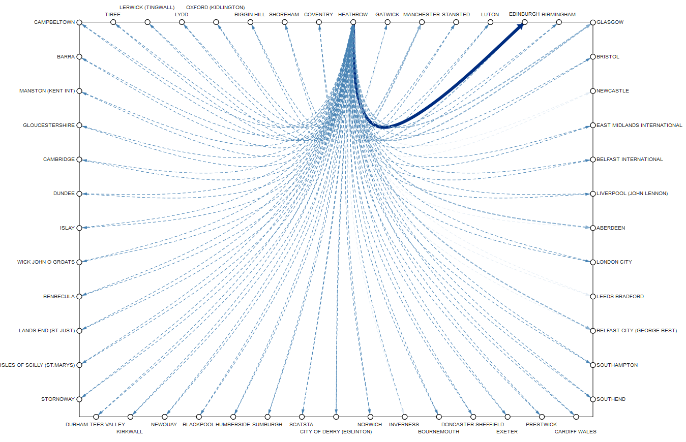

### Action Items
----------------

Below are the steps to follow to install ATSD and create figures for CAA metrics:

1. [Install the database](https://github.com/axibase/atsd-docs/tree/master/installation#installation) on a virtual machine or in a Linux container.
2. [Install Axibase Collector](https://github.com/axibase/axibase-collector-docs/blob/master/installation.md#axibase-collector-installation) and configure it to write data into your ATSD instance.
3. Import the  [csv-configs.xml](csv-configs.xml) into Axibase Collector.
4. Import the [jobs.xml](jobs.xml) into Axibase Collector. 
5. Login into your ATSD instance.
6. Select your desired CAA metric and begin building your visualizations on the **Configuration: Portals** page!

After installing ATSD and scrolling though the list of CAA metrics, create your own example and send it over to us.

If you require assistance in installing this software or have any questions, please feel free to [contact us](https://axibase.com/feedback/) and we would be happy to be of assistance!

    
### Appedix: CAA Metric List
--------------------------

uk-caa.air-pax-by-type-and-nat-of-op.pax_termial_scheduled_uk  
uk-caa.air-pax-by-type-and-nat-of-op.pax_terminal_charter_foreign_eu  
uk-caa.air-pax-by-type-and-nat-of-op.pax_terminal_charter_foreign_non_eu  
uk-caa.air-pax-by-type-and-nat-of-op.pax_terminal_charter_uk  
uk-caa.air-pax-by-type-and-nat-of-op.pax_terminal_scheduled_foreign_eu  
uk-caa.air-pax-by-type-and-nat-of-op.pax_terminal_scheduled_foreign_non_eu  
uk-caa.air-pax-by-type-and-nat-of-op.pax_terminal_scheduled_uk  
uk-caa.air-pax-by-type-and-nat-of-op.pax_transit_charter_foreign_eu  
uk-caa.air-pax-by-type-and-nat-of-op.pax_transit_charter_foreign_non_eu  
uk-caa.air-pax-by-type-and-nat-of-op.pax_transit_charter_uk  
uk-caa.air-pax-by-type-and-nat-of-op.pax_transit_scheduled_foreign_eu  
uk-caa.air-pax-by-type-and-nat-of-op.pax_transit_scheduled_foreign_non_eu  
uk-caa.air-pax-by-type-and-nat-of-op.pax_transit_scheduled_uk 
uk-caa.air-pax-by-type-and-nat-of-op.total_pax 
uk-caa.air-transport-movements-comparison.atms_cargo_aircraft_last_period 
uk-caa.air-transport-movements-comparison.atms_cargo_aircraft_percent 
uk-caa.air-transport-movements-comparison.atms_cargo_aircraft_this_period 
uk-caa.air-transport-movements-comparison.atms_passenger_aircraft_last_period 
uk-caa.air-transport-movements-comparison.atms_passenger_aircraft_percent 
uk-caa.air-transport-movements-comparison.atms_passenger_aircraft_this_period 
uk-caa.air-transport-movements-comparison.total_atms_last_period 
uk-caa.air-transport-movements-comparison.total_atms_percent 
uk-caa.air-transport-movements-comparison.total_atms_this_period 
uk-caa.air-transport-movements-vs-prev-year.atms_cargo_aircraft_last_period 
uk-caa.air-transport-movements-vs-prev-year.atms_cargo_aircraft_percent 
uk-caa.air-transport-movements-vs-prev-year.atms_cargo_aircraft_this_period 
uk-caa.air-transport-movements-vs-prev-year.atms_passenger_aircraft_last_period 
uk-caa.air-transport-movements-vs-prev-year.atms_passenger_aircraft_percent 
uk-caa.air-transport-movements-vs-prev-year.atms_passenger_aircraft_this_period 
uk-caa.air-transport-movements-vs-prev-year.total_atms_last_period 
uk-caa.air-transport-movements-vs-prev-year.total_atms_percent 
uk-caa.air-transport-movements-vs-prev-year.total_atms_this_period 
uk-caa.air-transport-movements.charter_all_domestic_atm 
uk-caa.air-transport-movements.charter_all_eu_international_atm 
uk-caa.air-transport-movements.charter_all_non_eu_international_atm 
uk-caa.air-transport-movements.charter_eu_international_passenger_atm 
uk-caa.air-transport-movements.charter_passenger_domestic_atm 
uk-caa.air-transport-movements.charter_passenger_non_eu_international_atm 
uk-caa.air-transport-movements.scheduled_all_domestic_atm 
uk-caa.air-transport-movements.scheduled_all_eu_international_atm 
uk-caa.air-transport-movements.scheduled_all_non_eu_international_atm 
uk-caa.air-transport-movements.scheduled_passenger_domestic_atm 
uk-caa.air-transport-movements.scheduled_passenger_eu_international_atm 
uk-caa.air-transport-movements.scheduled_passenger_non_eu_international_atm 
uk-caa.air-transport-movements.total_domestic_atm 
uk-caa.air-transport-movements.total_eu_atm 
uk-caa.air-transport-movements.total_non_eu_international_atm 
uk-caa.aircraft-movements.aero_club 
uk-caa.aircraft-movements.air_taxi 
uk-caa.aircraft-movements.air_transport 
uk-caa.aircraft-movements.business_aviation 
uk-caa.aircraft-movements.grand_total 
uk-caa.aircraft-movements.local_movements 
uk-caa.aircraft-movements.military 
uk-caa.aircraft-movements.official 
uk-caa.aircraft-movements.other_flights 
uk-caa.aircraft-movements.positioning_flights 
uk-caa.aircraft-movements.private_flights 
uk-caa.aircraft-movements.test_and_training 
uk-caa.aircraft-movementsaero_club 
uk-caa.aircraft-movementsair_taxi 
uk-caa.aircraft-movementsair_transport 
uk-caa.aircraft-movementsbusiness_aviation 
uk-caa.aircraft-movementsgrand_total 
uk-caa.aircraft-movementslocal_movements 
uk-caa.aircraft-movementsmilitary 
uk-caa.aircraft-movementsofficial 
uk-caa.aircraft-movementsother_flights 
uk-caa.aircraft-movementspositioning_flights 
uk-caa.aircraft-movementsprivate_flights 
uk-caa.aircraft-movementstest_and_training 
uk-caa.airport-landings-diverted.num_flights_day_1 
uk-caa.airport-landings-diverted.num_flights_day_10 
uk-caa.airport-landings-diverted.num_flights_day_11 
uk-caa.airport-landings-diverted.num_flights_day_12 
uk-caa.airport-landings-diverted.num_flights_day_13 
uk-caa.airport-landings-diverted.num_flights_day_14 
uk-caa.airport-landings-diverted.num_flights_day_15 
uk-caa.airport-landings-diverted.num_flights_day_16 
uk-caa.airport-landings-diverted.num_flights_day_17 
uk-caa.airport-landings-diverted.num_flights_day_18 
uk-caa.airport-landings-diverted.num_flights_day_19 
uk-caa.airport-landings-diverted.num_flights_day_2 
uk-caa.airport-landings-diverted.num_flights_day_20 
uk-caa.airport-landings-diverted.num_flights_day_21 
uk-caa.airport-landings-diverted.num_flights_day_22 
uk-caa.airport-landings-diverted.num_flights_day_23 
uk-caa.airport-landings-diverted.num_flights_day_24 
uk-caa.airport-landings-diverted.num_flights_day_25 
uk-caa.airport-landings-diverted.num_flights_day_26 
uk-caa.airport-landings-diverted.num_flights_day_27 
uk-caa.airport-landings-diverted.num_flights_day_28 
uk-caa.airport-landings-diverted.num_flights_day_29 
uk-caa.airport-landings-diverted.num_flights_day_3 
uk-caa.airport-landings-diverted.num_flights_day_30 
uk-caa.airport-landings-diverted.num_flights_day_31 
uk-caa.airport-landings-diverted.num_flights_day_4 
uk-caa.airport-landings-diverted.num_flights_day_5 
uk-caa.airport-landings-diverted.num_flights_day_6 
uk-caa.airport-landings-diverted.num_flights_day_7 
uk-caa.airport-landings-diverted.num_flights_day_8 
uk-caa.airport-landings-diverted.num_flights_day_9 
uk-caa.airport-landings-diverted.total_flights 
uk-caa.domestic-air-pax-route-analysis-by-airport.total_pax_charter_last_period 
uk-caa.domestic-air-pax-route-analysis-by-airport.total_pax_charter_this_period 
uk-caa.domestic-air-pax-route-analysis-by-airport.total_pax_last_period 
uk-caa.domestic-air-pax-route-analysis-by-airport.total_pax_percent 
uk-caa.domestic-air-pax-route-analysis-by-airport.total_pax_scheduled_last_period 
uk-caa.domestic-air-pax-route-analysis-by-airport.total_pax_scheduled_this_period 
uk-caa.domestic-air-pax-route-analysis-by-airport.total_pax_this_period 
uk-caa.domestic-air-pax-route-analysis-by-each-reporting-airport.total_pax_charter_last_period 
uk-caa.domestic-air-pax-route-analysis-by-each-reporting-airport.total_pax_charter_this_period 
uk-caa.domestic-air-pax-route-analysis-by-each-reporting-airport.total_pax_last_period 
uk-caa.domestic-air-pax-route-analysis-by-each-reporting-airport.total_pax_percent 
uk-caa.domestic-air-pax-route-analysis-by-each-reporting-airport.total_pax_scheduled_last_period 
uk-caa.domestic-air-pax-route-analysis-by-each-reporting-airport.total_pax_scheduled_this_period 
uk-caa.domestic-air-pax-route-analysis-by-each-reporting-airport.total_pax_this_period 
uk-caa.domestic-terminal-passenger-traffic.total_pax_charter_last_period 
uk-caa.domestic-terminal-passenger-traffic.total_pax_charter_this_period 
uk-caa.domestic-terminal-passenger-traffic.total_pax_last_period 
uk-caa.domestic-terminal-passenger-traffic.total_pax_percent 
uk-caa.domestic-terminal-passenger-traffic.total_pax_scheduled_last_period 
uk-caa.domestic-terminal-passenger-traffic.total_pax_scheduled_this_period 
uk-caa.domestic-terminal-passenger-traffic.total_pax_this_period 
uk-caa.domestic-terminal-pax-traffic.total_pax_charter_this_period 
uk-caa.domestic-terminal-pax-traffic.total_pax_last_period 
uk-caa.domestic-terminal-pax-traffic.total_pax_percent 
uk-caa.domestic-terminal-pax-traffic.total_pax_scheduled_this_period 
uk-caa.domestic-terminal-pax-traffic.total_pax_this_period 
uk-caa.eu-and-other-intl-passenger-traffic.total_pax_eu_charter_this_period 
uk-caa.eu-and-other-intl-passenger-traffic.total_pax_eu_cht_tp 
uk-caa.eu-and-other-intl-passenger-traffic.total_pax_eu_last_period 
uk-caa.eu-and-other-intl-passenger-traffic.total_pax_eu_lp 
uk-caa.eu-and-other-intl-passenger-traffic.total_pax_eu_pc 
uk-caa.eu-and-other-intl-passenger-traffic.total_pax_eu_percent 
uk-caa.eu-and-other-intl-passenger-traffic.total_pax_eu_scheduled_this_period 
uk-caa.eu-and-other-intl-passenger-traffic.total_pax_eu_shd_tp 
uk-caa.eu-and-other-intl-passenger-traffic.total_pax_eu_this_period 
uk-caa.eu-and-other-intl-passenger-traffic.total_pax_eu_tp 
uk-caa.eu-and-other-intl-passenger-traffic.total_pax_oi_cht_tp 
uk-caa.eu-and-other-intl-passenger-traffic.total_pax_oi_lp 
uk-caa.eu-and-other-intl-passenger-traffic.total_pax_oi_pc 
uk-caa.eu-and-other-intl-passenger-traffic.total_pax_oi_shd_tp 
uk-caa.eu-and-other-intl-passenger-traffic.total_pax_oi_tp 
uk-caa.eu-and-other-intl-passenger-traffic.total_pax_other_international_charter_this_period 
uk-caa.eu-and-other-intl-passenger-traffic.total_pax_other_international_last_period 
uk-caa.eu-and-other-intl-passenger-traffic.total_pax_other_international_percent 
uk-caa.eu-and-other-intl-passenger-traffic.total_pax_other_international_scheduled_this_period 
uk-caa.eu-and-other-intl-passenger-traffic.total_pax_other_international_this_period 
uk-caa.eu-and-other-intl-passenger-traffic.total_pax_this_period 
uk-caa.eu-and-other-intl-passenger-traffic.total_pax_tp 
uk-caa.eu-and-other-intl-terminal-pax-traffic.total_pax_eu_charter_this_period 
uk-caa.eu-and-other-intl-terminal-pax-traffic.total_pax_eu_last_period 
uk-caa.eu-and-other-intl-terminal-pax-traffic.total_pax_eu_percent 
uk-caa.eu-and-other-intl-terminal-pax-traffic.total_pax_eu_scheduled_this_period 
uk-caa.eu-and-other-intl-terminal-pax-traffic.total_pax_eu_this_period 
uk-caa.eu-and-other-intl-terminal-pax-traffic.total_pax_other_international_charter_this_period 
uk-caa.eu-and-other-intl-terminal-pax-traffic.total_pax_other_international_last_period 
uk-caa.eu-and-other-intl-terminal-pax-traffic.total_pax_other_international_percent 
uk-caa.eu-and-other-intl-terminal-pax-traffic.total_pax_other_international_scheduled_this_period 
uk-caa.eu-and-other-intl-terminal-pax-traffic.total_pax_other_international_this_period 
uk-caa.eu-and-other-intl-terminal-pax-traffic.total_pax_this_period 
uk-caa.eu_and_other_intl_passenger_traffic.total_pax_eu_cht_tp 
uk-caa.eu_and_other_intl_passenger_traffic.total_pax_eu_lp 
uk-caa.eu_and_other_intl_passenger_traffic.total_pax_eu_pc 
uk-caa.eu_and_other_intl_passenger_traffic.total_pax_eu_shd_tp 
uk-caa.eu_and_other_intl_passenger_traffic.total_pax_eu_tp 
uk-caa.eu_and_other_intl_passenger_traffic.total_pax_oi_cht_tp 
uk-caa.eu_and_other_intl_passenger_traffic.total_pax_oi_lp 
uk-caa.eu_and_other_intl_passenger_traffic.total_pax_oi_pc 
uk-caa.eu_and_other_intl_passenger_traffic.total_pax_oi_shd_tp 
uk-caa.eu_and_other_intl_passenger_traffic.total_pax_oi_tp 
uk-caa.eu_and_other_intl_passenger_traffic.total_pax_tp 
uk-caa.freight-by-aircraft-configuration.total_freight_cargo_aircraft_last_period 
uk-caa.freight-by-aircraft-configuration.total_freight_cargo_aircraft_percent_change 
uk-caa.freight-by-aircraft-configuration.total_freight_cargo_aircraft_this_period 
uk-caa.freight-by-aircraft-configuration.total_freight_last_period 
uk-caa.freight-by-aircraft-configuration.total_freight_passenger_aircraft_last_period 
uk-caa.freight-by-aircraft-configuration.total_freight_passenger_aircraft_percent_change 
uk-caa.freight-by-aircraft-configuration.total_freight_passenger_aircraft_this_period 
uk-caa.freight-by-aircraft-configuration.total_freight_percent_change 
uk-caa.freight-by-aircraft-configuration.total_freight_this_period 
uk-caa.freight-by-type-and-nat-of-op.freight_picked_up_charter_foreign_eu 
uk-caa.freight-by-type-and-nat-of-op.freight_picked_up_charter_foreign_non_eu 
uk-caa.freight-by-type-and-nat-of-op.freight_picked_up_charter_uk 
uk-caa.freight-by-type-and-nat-of-op.freight_picked_up_scheduled_foreign_eu 
uk-caa.freight-by-type-and-nat-of-op.freight_picked_up_scheduled_foreign_non_eu 
uk-caa.freight-by-type-and-nat-of-op.freight_picked_up_scheduled_uk 
uk-caa.freight-by-type-and-nat-of-op.freight_set_down_charter_foreign_eu 
uk-caa.freight-by-type-and-nat-of-op.freight_set_down_charter_foreign_non_eu 
uk-caa.freight-by-type-and-nat-of-op.freight_set_down_charter_uk 
uk-caa.freight-by-type-and-nat-of-op.freight_set_down_scheduled_foreign_eu 
uk-caa.freight-by-type-and-nat-of-op.freight_set_down_scheduled_foreign_non_eu 
uk-caa.freight-by-type-and-nat-of-op.freight_set_down_scheduled_uk 
uk-caa.freight-by-type-and-nat-of-op.total_freight 
uk-caa.freight-by-type-and-nationality.freight_picked_up_charter_foreign_eu 
uk-caa.freight-by-type-and-nationality.freight_picked_up_charter_foreign_non_eu 
uk-caa.freight-by-type-and-nationality.freight_picked_up_charter_uk 
uk-caa.freight-by-type-and-nationality.freight_picked_up_scheduled_foreign_eu 
uk-caa.freight-by-type-and-nationality.freight_picked_up_scheduled_foreign_non_eu 
uk-caa.freight-by-type-and-nationality.freight_picked_up_scheduled_uk 
uk-caa.freight-by-type-and-nationality.freight_set_down_charter_foreign_eu 
uk-caa.freight-by-type-and-nationality.freight_set_down_charter_foreign_non_eu 
uk-caa.freight-by-type-and-nationality.freight_set_down_charter_uk 
uk-caa.freight-by-type-and-nationality.freight_set_down_scheduled_foreign_eu 
uk-caa.freight-by-type-and-nationality.freight_set_down_scheduled_foreign_non_eu 
uk-caa.freight-by-type-and-nationality.freight_set_down_scheduled_uk 
uk-caa.freight-by-type-and-nationality.total_freight 
uk-caa.international-and-domestic-freight.freight_charter_cargo_aircraft_foreign_eu 
uk-caa.international-and-domestic-freight.freight_charter_cargo_aircraft_foreign_non_eu 
uk-caa.international-and-domestic-freight.freight_charter_cargo_aircraft_uk 
uk-caa.international-and-domestic-freight.freight_charter_passenger_aircraft_foreign_eu 
uk-caa.international-and-domestic-freight.freight_charter_passenger_aircraft_foreign_non_eu 
uk-caa.international-and-domestic-freight.freight_charter_passenger_aircraft_uk 
uk-caa.international-and-domestic-freight.freight_passenger_aircraft_foreign_eu 
uk-caa.international-and-domestic-freight.freight_schedueld_passenger_aircraft_uk 
uk-caa.international-and-domestic-freight.freight_scheduled_cargo_aircraft_foreign_eu 
uk-caa.international-and-domestic-freight.freight_scheduled_cargo_aircraft_foreign_non_eu 
uk-caa.international-and-domestic-freight.freight_scheduled_cargo_aircraft_uk 
uk-caa.international-and-domestic-freight.freight_scheduled_passenger_aircraft_foreign_eu 
uk-caa.international-and-domestic-freight.freight_scheduled_passenger_aircraft_foreign_eu1 
uk-caa.international-and-domestic-freight.freight_scheduled_passenger_aircraft_foreign_non_eu 
uk-caa.international-and-domestic-mail.mail_charter_cargo_aircraft_foreign_eu 
uk-caa.international-and-domestic-mail.mail_charter_cargo_aircraft_foreign_non_eu 
uk-caa.international-and-domestic-mail.mail_charter_cargo_aircraft_uk 
uk-caa.international-and-domestic-mail.mail_charter_passenger_aircraft_foreign_eu 
uk-caa.international-and-domestic-mail.mail_charter_passenger_aircraft_foreign_non_eu 
uk-caa.international-and-domestic-mail.mail_charter_passenger_aircraft_uk 
uk-caa.international-and-domestic-mail.mail_scheduled_cargo_aircraft_foreign_eu 
uk-caa.international-and-domestic-mail.mail_scheduled_cargo_aircraft_foreign_non_eu 
uk-caa.international-and-domestic-mail.mail_scheduled_cargo_aircraft_uk 
uk-caa.international-and-domestic-mail.mail_scheduled_passenger_aircraft_foreign_eu 
uk-caa.international-and-domestic-mail.mail_scheduled_passenger_aircraft_foreign_non_eu 
uk-caa.international-and-domestic-mail.mail_scheduled_passenger_aircraft_uk 
uk-caa.intl-air-pax-traffic-route-analysis.total_pax_charter_last_period 
uk-caa.intl-air-pax-traffic-route-analysis.total_pax_charter_this_period 
uk-caa.intl-air-pax-traffic-route-analysis.total_pax_last_period 
uk-caa.intl-air-pax-traffic-route-analysis.total_pax_percent 
uk-caa.intl-air-pax-traffic-route-analysis.total_pax_scheduled_last_period 
uk-caa.intl-air-pax-traffic-route-analysis.total_pax_scheduled_this_period 
uk-caa.intl-air-pax-traffic-route-analysis.total_pax_this_period 
uk-caa.intl-and-domestic-freight.freight_charter_cargo_aircraft_foreign_eu 
uk-caa.intl-and-domestic-freight.freight_charter_cargo_aircraft_foreign_non_eu 
uk-caa.intl-and-domestic-freight.freight_charter_cargo_aircraft_uk 
uk-caa.intl-and-domestic-freight.freight_charter_passenger_aircraft_foreign_non_eu 
uk-caa.intl-and-domestic-freight.freight_charter_passenger_aircraft_uk 
uk-caa.intl-and-domestic-freight.freight_passenger_aircraft_foreign_eu 
uk-caa.intl-and-domestic-freight.freight_schedueld_passenger_aircraft_uk 
uk-caa.intl-and-domestic-freight.freight_scheduled_cargo_aircraft_foreign_eu 
uk-caa.intl-and-domestic-freight.freight_scheduled_cargo_aircraft_foreign_non_eu 
uk-caa.intl-and-domestic-freight.freight_scheduled_cargo_aircraft_uk 
uk-caa.intl-and-domestic-freight.freight_scheduled_passenger_aircraft_foreign_eu 
uk-caa.intl-and-domestic-freight.freight_scheduled_passenger_aircraft_foreign_eu1 
uk-caa.intl-and-domestic-mail.mail_charter_cargo_aircraft_foreign_eu 
uk-caa.intl-and-domestic-mail.mail_charter_cargo_aircraft_foreign_non_eu 
uk-caa.intl-and-domestic-mail.mail_charter_cargo_aircraft_uk 
uk-caa.intl-and-domestic-mail.mail_charter_passenger_aircraft_foreign_eu 
uk-caa.intl-and-domestic-mail.mail_charter_passenger_aircraft_foreign_non_eu 
uk-caa.intl-and-domestic-mail.mail_charter_passenger_aircraft_uk 
uk-caa.intl-and-domestic-mail.mail_scheduled_cargo_aircraft_foreign_eu 
uk-caa.intl-and-domestic-mail.mail_scheduled_cargo_aircraft_foreign_non_eu 
uk-caa.intl-and-domestic-mail.mail_scheduled_cargo_aircraft_uk 
uk-caa.intl-and-domestic-mail.mail_scheduled_passenger_aircraft_foreign_eu 
uk-caa.intl-and-domestic-mail.mail_scheduled_passenger_aircraft_foreign_non_eu 
uk-caa.intl-and-domestic-mail.mail_scheduled_passenger_aircraft_uk 
uk-caa.mail-by-aircraft-configuration.total_mail_cargo_aircraft_last_period 
uk-caa.mail-by-aircraft-configuration.total_mail_cargo_aircraft_percent_change 
uk-caa.mail-by-aircraft-configuration.total_mail_cargo_aircraft_this_period 
uk-caa.mail-by-aircraft-configuration.total_mail_last_period 
uk-caa.mail-by-aircraft-configuration.total_mail_passenger_aircraft_last_period 
uk-caa.mail-by-aircraft-configuration.total_mail_passenger_aircraft_percent_change 
uk-caa.mail-by-aircraft-configuration.total_mail_passenger_aircraft_this_period 
uk-caa.mail-by-aircraft-configuration.total_mail_percent_change 
uk-caa.mail-by-aircraft-configuration.total_mail_this_period 
uk-caa.mail-by-type-and-nat-of-op.mail_picked_up_charter_foreign_eu 
uk-caa.mail-by-type-and-nat-of-op.mail_picked_up_charter_foreign_non_eu 
uk-caa.mail-by-type-and-nat-of-op.mail_picked_up_charter_uk 
uk-caa.mail-by-type-and-nat-of-op.mail_picked_up_scheduled_foreign_eu 
uk-caa.mail-by-type-and-nat-of-op.mail_picked_up_scheduled_foreign_non_eu 
uk-caa.mail-by-type-and-nat-of-op.mail_picked_up_scheduled_uk 
uk-caa.mail-by-type-and-nat-of-op.mail_set_down_charter_foreign_eu 
uk-caa.mail-by-type-and-nat-of-op.mail_set_down_charter_foreign_non_eu 
uk-caa.mail-by-type-and-nat-of-op.mail_set_down_charter_uk 
uk-caa.mail-by-type-and-nat-of-op.mail_set_down_scheduled_foreign_eu 
uk-caa.mail-by-type-and-nat-of-op.mail_set_down_scheduled_foreign_non_eu 
uk-caa.mail-by-type-and-nat-of-op.mail_set_down_scheduled_uk 
uk-caa.mail-by-type-and-nat-of-op.total_mail 
uk-caa.mail-by-type-and-nationality.mail_picked_up_charter_foreign_eu 
uk-caa.mail-by-type-and-nationality.mail_picked_up_charter_foreign_non_eu 
uk-caa.mail-by-type-and-nationality.mail_picked_up_charter_uk 
uk-caa.mail-by-type-and-nationality.mail_picked_up_scheduled_foreign_eu 
uk-caa.mail-by-type-and-nationality.mail_picked_up_scheduled_foreign_non_eu 
uk-caa.mail-by-type-and-nationality.mail_picked_up_scheduled_uk 
uk-caa.mail-by-type-and-nationality.mail_set_down_charter_foreign_eu 
uk-caa.mail-by-type-and-nationality.mail_set_down_charter_foreign_non_eu 
uk-caa.mail-by-type-and-nationality.mail_set_down_charter_uk 
uk-caa.mail-by-type-and-nationality.mail_set_down_scheduled_foreign_eu 
uk-caa.mail-by-type-and-nationality.mail_set_down_scheduled_foreign_non_eu 
uk-caa.mail-by-type-and-nationality.mail_set_down_scheduled_uk 
uk-caa.mail-by-type-and-nationality.total_mail 
uk-caa.pax-and-air-transport-movements-split-by-fixed-and-rotary-wing-aircraft.total_atms_fixed_wing_last_period 
uk-caa.pax-and-air-transport-movements-split-by-fixed-and-rotary-wing-aircraft.total_atms_fixed_wing_percent_change 
uk-caa.pax-and-air-transport-movements-split-by-fixed-and-rotary-wing-aircraft.total_atms_fixed_wing_this_period 
uk-caa.pax-and-air-transport-movements-split-by-fixed-and-rotary-wing-aircraft.total_atms_rotary_wing_last_period 
uk-caa.pax-and-air-transport-movements-split-by-fixed-and-rotary-wing-aircraft.total_atms_rotary_wing_percent_change 
uk-caa.pax-and-air-transport-movements-split-by-fixed-and-rotary-wing-aircraft.total_atms_rotary_wing_this_period 
uk-caa.pax-and-air-transport-movements-split-by-fixed-and-rotary-wing-aircraft.total_pax_fixed_wing_last_period 
uk-caa.pax-and-air-transport-movements-split-by-fixed-and-rotary-wing-aircraft.total_pax_fixed_wing_percent_change 
uk-caa.pax-and-air-transport-movements-split-by-fixed-and-rotary-wing-aircraft.total_pax_fixed_wing_this_period 
uk-caa.pax-and-air-transport-movements-split-by-fixed-and-rotary-wing-aircraft.total_pax_rotary_wing_last_period 
uk-caa.pax-and-air-transport-movements-split-by-fixed-and-rotary-wing-aircraft.total_pax_rotary_wing_percent_change 
uk-caa.pax-and-air-transport-movements-split-by-fixed-and-rotary-wing-aircraft.total_pax_rotary_wing_this_period 
uk-caa.pax-and-atm-by-fixed-rotary-wing-aircraft.total_atms_fixed_wing_last_period 
uk-caa.pax-and-atm-by-fixed-rotary-wing-aircraft.total_atms_fixed_wing_percent_change 
uk-caa.pax-and-atm-by-fixed-rotary-wing-aircraft.total_atms_fixed_wing_this_period 
uk-caa.pax-and-atm-by-fixed-rotary-wing-aircraft.total_atms_rotary_wing_last_period 
uk-caa.pax-and-atm-by-fixed-rotary-wing-aircraft.total_atms_rotary_wing_percent_change 
uk-caa.pax-and-atm-by-fixed-rotary-wing-aircraft.total_atms_rotary_wing_this_period 
uk-caa.pax-and-atm-by-fixed-rotary-wing-aircraft.total_pax_fixed_wing_last_period 
uk-caa.pax-and-atm-by-fixed-rotary-wing-aircraft.total_pax_fixed_wing_percent_change 
uk-caa.pax-and-atm-by-fixed-rotary-wing-aircraft.total_pax_fixed_wing_this_period 
uk-caa.pax-and-atm-by-fixed-rotary-wing-aircraft.total_pax_rotary_wing_last_period 
uk-caa.pax-and-atm-by-fixed-rotary-wing-aircraft.total_pax_rotary_wing_percent_change 
uk-caa.pax-and-atm-by-fixed-rotary-wing-aircraft.total_pax_rotary_wing_this_period 
uk-caa.size-of-uk-airports.last_year_pax 
uk-caa.size-of-uk-airports.last_year_total_pax_uk_airports 
uk-caa.size-of-uk-airports.this_year_pax 
uk-caa.size-of-uk-airports.this_year_total_pax_uk_airports 
uk-caa.size-of-uk-airportslast_year_pax 
uk-caa.size-of-uk-airportslast_year_total_pax_uk_airports 
uk-caa.size-of-uk-airportsthis_year_pax 
uk-caa.size-of-uk-airportsthis_year_total_pax_uk_airports 
uk-caa.summary-of-activity-at-uk-airports.atms_charter 
uk-caa.summary-of-activity-at-uk-airports.atms_scheduled 
uk-caa.summary-of-activity-at-uk-airports.charter_freight 
uk-caa.summary-of-activity-at-uk-airports.charter_mail 
uk-caa.summary-of-activity-at-uk-airports.scheduled_freight 
uk-caa.summary-of-activity-at-uk-airports.scheduled_mail 
uk-caa.summary-of-activity-at-uk-airports.terminal_charter_pax 
uk-caa.summary-of-activity-at-uk-airports.terminal_scheduled_pax 
uk-caa.summary-of-activity-at-uk-airports.transit_charter_pax 
uk-caa.summary-of-activity-at-uk-airports.transit_scheduled_pax 
uk-caa.terminal-and-transit-passengers.terminal_pax_last_period 
uk-caa.terminal-and-transit-passengers.terminal_pax_percent 
uk-caa.terminal-and-transit-passengers.terminal_pax_this_period 
uk-caa.terminal-and-transit-passengers.total_pax_last_period 
uk-caa.terminal-and-transit-passengers.total_pax_percent 
uk-caa.terminal-and-transit-passengers.total_pax_this_period 
uk-caa.terminal-and-transit-passengers.transit_pax_last_period 
uk-caa.terminal-and-transit-passengers.transit_pax_percent 
uk-caa.terminal-and-transit-passengers.transit_pax_this_period 
uk-caa.terminal-and-transit-pax.terminal_pax_last_period 
uk-caa.terminal-and-transit-pax.terminal_pax_percent 
uk-caa.terminal-and-transit-pax.terminal_pax_this_period 
uk-caa.terminal-and-transit-pax.total_pax_last_period 
uk-caa.terminal-and-transit-pax.total_pax_percent 
uk-caa.terminal-and-transit-pax.total_pax_this_period 
uk-caa.terminal-and-transit-pax.transit_pax_last_period 
uk-caa.terminal-and-transit-pax.transit_pax_percent 
uk-caa.terminal-and-transit-pax.transit_pax_this_period 
uk-caa.trans-move-by-type.airport_cluster 
uk-caa.trans-move-by-type.atms_charter_foreign_eu_operator 
uk-caa.trans-move-by-type.atms_charter_foreign_non_eu_operator 
uk-caa.trans-move-by-type.atms_charter_uk_operator 
uk-caa.trans-move-by-type.atms_scheduled_foreign_eu_operator 
uk-caa.trans-move-by-type.atms_scheduled_foreign_non_eu_operator 
uk-caa.trans-move-by-type.atms_scheduled_uk_operator 
uk-caa.trans-move-by-type.rpt_apt_grp_cd 
uk-caa.trans-move-by-type.total_atms 
uk-caa.transport-movements-by-type.airport_cluster 
uk-caa.transport-movements-by-type.atms_charter_foreign_eu_operator 
uk-caa.transport-movements-by-type.atms_charter_foreign_non_eu_operator 
uk-caa.transport-movements-by-type.atms_charter_uk_operator 
uk-caa.transport-movements-by-type.atms_scheduled_foreign_eu_operator 
uk-caa.transport-movements-by-type.atms_scheduled_foreign_non_eu_operator 
uk-caa.transport-movements-by-type.atms_scheduled_uk_operator 
uk-caa.transport-movements-by-type.rpt_apt_grp_cd 
uk-caa.transport-movements-by-type.total_atms 
     
