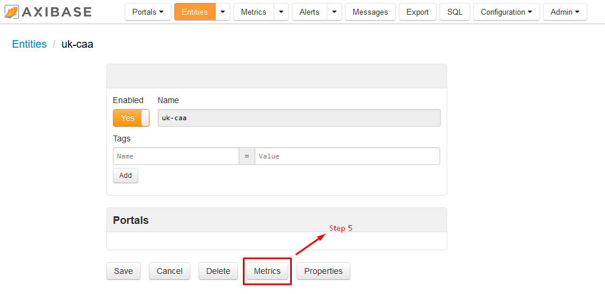

Analyzing UK Aviation Statistics using CAA datasets
===================================================

### Introduction
----------------

Are airports getting more and more crowded every year?

What some are the busiest airports in the United Kingdom (UK)?

How often do airplanes get delayed?

To answer such questions, the Civil Aviation Authority (CAA) serves as an independent data specialist for the UK government. Established in 1972, the CAA collects and reports on key aviation metrics which summarize the level of activity at UK airports. According to their website, [caa.co.uk](https://www.caa.co.uk/Data-and-analysis/UK-aviation-market/Airports/Datasets/UK-Airport-data/Airport-data-2016-06/), the CAA collects statistics from more than 60 UK airports. Specific metrics are measured for items such as international and domestic mail shipped to and from UK airports (tons), international passenger traffic to and from UK airports, and terminal passenger totals at different UK airports, among many other metrics. CAA datasets are available in two separate formats: raw datasets and aviation trends.

### CAA Raw Dataset
-------------------

CAA raw datasets are published every month, and are available ranging back to 1973. From 1990 to the present day, these reports are available in CSV and PDF format. Datasets published before 1990 are available only in PDF format. These datasets merely contain raw data; that is they do not contain any information on analytics or trends, and do not contain any graphs or figures. A link to these raw datasets may be found at the below link:

[https://www.caa.co.uk/Data-and-analysis/UK-aviation-market/Airports/Datasets/UK-airport-data/](https://www.caa.co.uk/Data-and-analysis/UK-aviation-market/Airports/Datasets/UK-airport-data/)

### CAA Aviation Trends
-----------------------

CAA aviation trends are published per quarter (four times per year). These reports date back to 2008 and are published only in PDF format. Language is used in these reports to attempt to put the datasets into context. Graphs and tables showing volumes and year over year (y-o-y) growth rates of datasets are published. These aviation trend files may be found at the below link:

[https://www.caa.co.uk/Data-and-analysis/UK-aviation-market/Airports/Aviation-Trends/](https://www.caa.co.uk/Data-and-analysis/UK-aviation-market/Airports/Aviation-Trends/)

Below is an image of terminal passengers at UK airports from [AviationTrends_2008_Q4](https://www.caa.co.uk/uploadedFiles/CAA/Content/Standard_Content/Data_and_analysis/Analysis_reports/Aviation_trends/AviationTrends_2008_Q4.pdf). In the associated text, terminal passengers are described as "those travelers who board or disembark an aircraft on a commercial flight at a reporting UK airport." The data is shown for scheduled and chartered flights for London and Regional airports. Quantities of travelers and growth percentages are presented comparing, in this case, Q4 of 2008 to 2007, and the entire "rolling" years of Q1 through Q4 of 2007 and 2008, respectively.    

Below is an image from the same report showing terminal passengers at UK airports by origin / destination.

The data is presented for scheduled and chartered flights for passengers from within the UK, Europe, North America, and the Rest of the World. Again, quantities of travelers and growth percentages are presented comparing Q4 of 2008 to 2007, and the entire "rolling" years of Q1 through Q4 of 2007 and 2008, respectively. To summarize the graph, the following sentence is used: "Passenger numbers to all destination groups fell in quarter 4 2008, by around 8%, except for passengers numbers to the Rest of the World destination group, which fell by considerably less."

While the aviation trend PDF files can be helpful, they seem to have a very limited scope. Typically, between only 3 and 4 graphs are presented to summarize an entire quarter in one report. To gain a meaningful understanding of the data and trends, you would need to open multiple files at a time and compare trends, which can be difficult and time consuming to work though. 

### Axibase's Time Series Database (ATSD)
-----------------------------------------

The processing of CAA datasets using Axibase's Time Series Database (ATSD) is much less cumbersome. Processing the same data with ATSD is less time consuming because the user has the ability to easily toggle between different datasets and years, and filter out for a specific airport location or metric. When loading data for a particular dataset the collector uses metadata to understand the meaning of columns and automatically extract dates, times, and categories from the data files. Besides, ATSD stores the data in the user's own database so that this public data can be combined with internal data sources as well as mixed and matched across different datasets. Once you install ATSD, you don't have to:

* Add additional datasets from caa.co.uk
* Manipulate and design table schema
* Provision an application server
* Write programs to parse and digest these types of files.

Rather, you can configure a scheduled job to retrieve the file from the specified endpoint and have ATSD parse it according to pre-defined rules. Once you have raw data in ATSD, creating and sharing reports with built-in widgets is fairly trivial. The reports will be continuously updated as new data comes in.

With ATSD, the user is able display the dataset in an easily understandable manner. Here, you can explore our complete dataset for CAA aviation statistics by clicking below on the default portal:

Here, the user has the ability to filter between 228 different CAA airport aviation metrics. Additionally, the user can filter between 55 different UK airports and filter by airport groups (London area, other UK, or no UK reporting airports). The figure below shows air passengers totals for 2015 for all 55 airports from January 2015 to February 2016.

### Creating Custom Portals
---------------------------

Custom portals can be created from the default portal. The user has the capability to change or display certain aspects of the dataset to their liking. For example, the user may change graph styling, such as color, graph type, and other display options.

Likewise, by customizing the data the way you want, you can filter out any unnecessary information. If, for example, you are interested in comparing UK Domestic terminal traffic for scheduled flights for different years, you can customize your portal from the default portal to only show that information.

The default portal, from which you can customize the dataset results, again can be found here: **[DEFAULT](https://apps.axibase.com/chartlab/972babb9)**

We will walk through a brief example on how to customize the default portal to compare UK Domestic terminal traffic for scheduled flights between 2015 and 2016. But before we walk through this example, the user must first install ATSD:

1. [Install the database](https://github.com/axibase/atsd-docs/tree/master/installation#installation) on a virtual machine or in a Linux container.
2. [Install Axibase Collector](https://github.com/axibase/axibase-collector-docs/blob/master/installation.md#axibase-collector-installation) and configure it to write data into your ATSD instance.
3. Login into your ATSD account.

If you require assistance in installing this software or have any questions, please feel free to [contact us](https://axibase.com/feedback/) and we would be happy to be of assistance!

### Example 1
-------------

1.  Open the default portal and delete the configuration sections as shown in the image below. We are only wanting to show one series, so there is no need for **multiple-series**, **series-limit**, **tags-dropdown**, **label-format**, **tags-dropdown-style**, or the **dropdown** control.

    

2.  Next, we want to select the one **metric** which we would like to filter for. Once you have installed ATSD, you will want to navigate to the metric list to see the corresponding names. The first dropdown in Chart Lab only contains the shortened version of the **metric** names, so you will need to log into your [https://nur.axibase.com](https://nur.axibase.com) account to view the raw metric names. The image below contains the standard view after you have logged in. Press **Entities**. 

    
    
3.  Enter **uk-caa** into **Name Mask**. Press Apply.

    
    
4.  Select **uk-caa**.  

    

5.  On the following page select **Metrics**.

    

6.  Here, you will see a list of metrics, which are available for the CAA entity. In our case, we are looking for UK Domestic terminal traffic for scheduled flights. Copy the seventh entry from the top of the page, **uk-caa.air-pax-by-type-and-nat-of-op.pax_terminal_scheduled_uk**.

    
    
7.  Navigate back to the portal. Type in **metric=** and paste the copied metric name from the metric list.
8.  Since we are comparing 2015 and 2016 values, enter **starttime = current_year** and **endtime = next_year**.
9.  As we will be looking at total domestic travel, enter **group-statistic = sum** and change mode from **column-stack** to **column**. The **group-statistic = sum** command calculates the total number of passengers for all airports in a given month, and the **column** will only show the total number of passengers together as one column per month.  

    Your configuration should now look something like the image below.
    
    

10. Next, again since we are looking at total domestic value, we need to select all airport and group names.  Create a new heading for **[tags]** below **[widget]** and enter **airport_name** = * and **group_name** = * (* is shorthand for all).
11. To display data for 2016, create a new **[series]** and enter **label = current year**.
12. To display data for 2015, create a new **[series]** and enter **label = previous year**. Enter **time-offset = 1 year** and **color = orange**. The **time-offset = 1 year** command shifts historical data by the specific lag to the current time. In our case, data for the year 2015 is displayed as if it were data for 2016.

    Your configuration should now look like the image below.
    
    
    
13. Press **Run**! Your figure should now look like the image below. 

    
    
    Now, we can take a few more steps to clean up our figure.
    
14. Change the title to **UK Domestic Terminal Traffic on Scheduled Flights**.
15. Under **metric** enter **format = numeric** to shorten the length of the outputted numbers.
16. Press **Run**!

    Your configuration should now look like the image below.
    
    

Here you can explore this configuration in Chart Lab: 

### Example 2
-------------

Now that we are familiar with the CAA entity and different available metrics, we can, as an alternative to building a configuration from the default portal, create a configuration from the generic widget settings in Chart Lab. Let us now walk through building a calendar Widget to show the total international passengers traveling from UK airports within the last year.

The default Chart Lab portal can be found here:

1.  Press the Chart Lab link above.
2.  Change the source to **ATSD** and select **calendar** from the Widget drop-down.
3.  Delete the section of the configuration as shown in the image below.

    
  
4.  Change the entity name to **uk-caa** and the metric name to **uk-caa.eu-and-other-intl-passenger-traffic.total_pax_eu_last_period**, which was taken from the metric list in ATSD.
5.  Since we want to display international passenger figures for all available UK airports, create a **[tags]** heading. Under this heading, enter in **airport_name** = * (* is shorthand for all). 
6.  Under the **[configuration]** heading, enter **timezone = UTC**. 
7.  Under the **[widget]** heading, delete the line **timespan = 3 hour**. 
8.  To specific our new timespan, enter in **starttime = 2015-01-01T00:00:00z** and on the next line **endtime = current_month**.
9.  Modify the **summarize-period** line from 10 minutes to 1 month.
10. To display airport names in our figure, enter **label-format = tags.airport_name**. 

    Your configuration should now look like the image below.
  
    
  
11. Press Run!

    Your figure should look like the image below.
    
    
    
    The are a few more steps we can take to clean up our figure.
    
12. To create a figure title, enter **title = UK International Terminal Passenger Traffic: Total Passenger**.
13. To increase the size of our figure, under **[configuration]** change offset-right from 50 to 0 and height-units from 2 to 1.
14. Press Run!
    
    Your figure should look like the image below.
    
    
    
    From our figure we can see a month by month breakdown of international passenger traffic from all UK airports. The calendar widget is useful for quickly gaining an understanding of the general trends of a particular dataset, as we as observing any outliers in the set. For example, we can see that in 2015 the most popular travel season was generally from May to October, as indicated by the dark blue square shading. We can also quickly observe outliers in Shoreham and Oxford (Kidlington) for the months of January and February, respectively. You can explore this portal by clicking on the link below.
    
    
    
    We can quickly change this widget to output a different figure type. For instance, we can change our widget from calendar to pie to see total international passenger figures from January 2015 to June 2016.
  
15. Under the **[widget]** heading, change type from calender to pie.
16. Delete the lines **summarize-period = 1 month** and **color-range = blue**.
17. Change the title to **UK International Terminal Passenger Traffic: Passenger Totals from January 2015 to June 2016**.
18. Press Run!

    Your new figure should look like the image below.
    
    
    
    You can explore this portal by clicking on the link below.
    
    
    
### Action Items
----------------

Again, below are the steps to follow to install ATSD and create figures for CAA metrics:

1. [Install the database](https://github.com/axibase/atsd-docs/tree/master/installation#installation) on a virtual machine or in a Linux container.
2. [Install Axibase Collector](https://github.com/axibase/axibase-collector-docs/blob/master/installation.md#axibase-collector-installation) and configure it to write data into your ATSD instance.
3. Login into your ATSD account.
4. Select your desired CAA metric and begin building your configuration!

After installing ATSD and scroll though the list of CAA metrics, create your own example and send it over to us.

If you require assistance in installing this software or have any questions, please feel free to [contact us](https://axibase.com/feedback/) and we would be happy to be of assistance!

    
     
