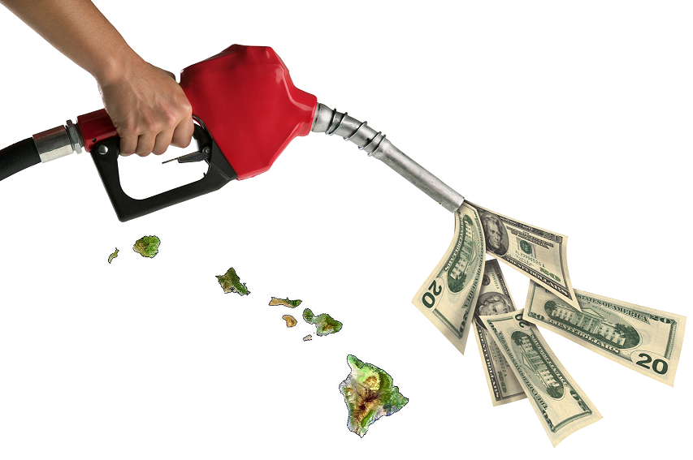
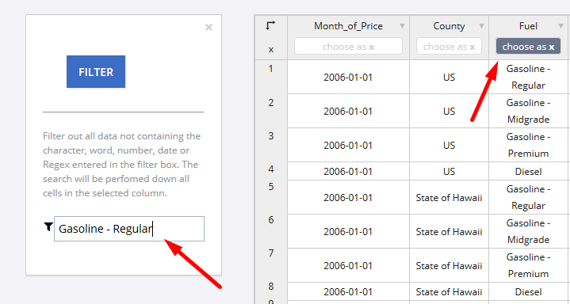

Pain at the Pump - a Closer Look at Hawaii's High Fuel Prices
============================================================

Hawaii. Sunshine. Beautiful beaches. Piñas coladas. These are a few of the great motivators for moving to one of America's favorite vacation destinations. However,
Hawaii has some of the most expensive consumer products in the nation. According to [expastistan.com](https://www.expatistan.com/cost-of-living/comparison/new-york-city/honolulu), 
in comparision to New York City, Honolulu is more expensive by the percentages for the following items:

* 1 liter of whole fat milk: 41%	
* 1 kg (2 lbs) of apples: 68%		
* Bread for 2 people for 1 day: 67%

In addition to exorbitant food prices, Hawaii currently holds the crown of having the highest fuel prices in the entire United States, according to [gasbuddy.com](https://www.gasbuddy.com/USA). The Aloha state has long held the 
repuation of having the most expensive fuel in the land. However, until recently, such trends have been difficult to quantify.  In order to better analyze datasets such as Hawaiian fuel prices,
the US government in 2009 established a data collection website, [data.gov](https://www.data.gov/). Datasets are available online to conduct research, develop web applications, and design data visualizations, 
on a variety of topics ranging from agriculture, to manufacturing, to health, among many other.  

From 2006 to 2012, the State of Hawaii compiled AAA fuel prices for each of the following fuel types:

**Diesel**, **Gasoline - Regular**, **Gasoline - Midgrade**, **Gasoline - Premium**

In turn, each of these fuel prices were recorded for the following locations:

**Hilo**, **Honolulu**, **Wailuku**, **US**, **State of Hawaii**

This dataset can be found here: [http://catalog.data.gov/dataset/aaa-fuel-prices-52bf0](http://catalog.data.gov/dataset/aaa-fuel-prices-52bf0)

On the data.gov website, datasets can be downloaded as a CSV, RDF, JSON, or a XML file. To help interpret this data, the user is given the option of opening the CSV file with either [CartoDB](https://carto.com/) 
or [plotly](https://plot.ly/). CartoDB is primarily a mapping software and does not allow the user to plot the data set (in this case gas prices of Hawaii) over time. plotly fairly easily allows
the user to display the relationship of gas prices over time; however, without extensively manipulating the raw data set, each location is allowed to be compared with only one fuel type at a time. 

We will quickly run through plotting this dataset in plotly.

Once the raw data is opened via plotly, the user must select **Filter** from Data Tools, as shown below. 

Next, the user must **Filter** by **Fuel**, in our case Gasoline - Regular.

Finally, to output the data, the user must select **Group By** and choose **Month_of_Price** as the x axis, **County** as G (this will seperate the prices of fuel for each 
location), and the **Price** as the y axis.

 

The ouput will look as is shown below. The graph is relatively easy to interpret. The user can see that Gasoline - Regular fuel prices in Hawaii have for the last 6
years steadily remained more expensive than US average prices. The main drawback of using plotly to process datasets from data.gov seems to be the extensive
time and effort it would take to create outputs for each of the following fuel types.

The processing of datasets using Axibase's Time Series Database (ATSD) is much less cubersome. With ATSD you don't have to stage a database, manipulate and design
table schema, provision an application server, and write programs to parse and digest these types of files. Rather, you can configure a scheduled job to retrieve
the file from the specfied endpoint and have ATSD parse it according to pre-defined rules. Once you have raw data in ATSD, creating and sharing reports with
built-in widgets is fairly trivial. The reports will be continuously updated as new data comes in.

With ATSD, the user is able display the dataset in an easily understandable manner. The below figure shows each fuel type for each of the 5 locations.

 

The dataset can be sorted by location and/or fuel type, and the user can easily toggle through comparing different scenarios. The next 2 figures show outputs
comparing fuel types on Hilo and Diesel prices by location, respectively.

The dataset can also be manipulated to show price differences for different fuel types, for example for diesel between Hawaii and the US.

     
